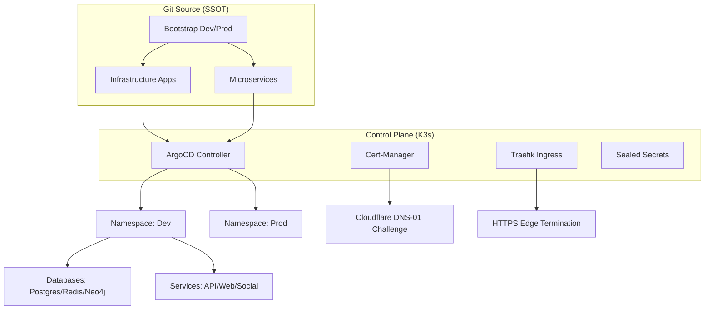

# Volontariapp GitOps Infrastructure

> [!NOTE]
> This repository serves as the central GitOps orchestrator for the Volontariapp ecosystem, managing multi-environment deployments on K3s through ArgoCD and Kustomize.

## Architecture Overview

The infrastructure follows a declarative "App-of-Apps" pattern, ensuring that the cluster state remains synchronized with the Git repository.



## Environment Matrix

| Feature | Development (dev) | Production (prod) |
| :--- | :--- | :--- |
| **Namespace** | `dev` | `prod` |
| **PSA Level** | `restricted` | `restricted` |
| **Database Replicas** | 1 (Standalone) | 1 (Resource Optimized) |
| **Ingress Domain** | `dev.cyrus-ag.com` | `cyrus-ag.com` |
| **Sync Policy** | Automated (Auto-Heal) | Manual (Prune Propagated) |

## Security Framework

The infrastructure implements a layered Zero-Trust security model.

| Layer | Implementation | Description |
| :--- | :--- | :--- |
| **Secret Management** | Bitnami Sealed Secrets | RSA-4096 asymmetric encryption for GitOps. |
| **Network Security** | Kubernetes NetworkPolicies | Default-deny egress/ingress between microservices. |
| **Runtime Security** | Pod Security Admissions | Strict enforcement of non-root, no-privilege execution. |
| **Identity / TLS** | Let's Encrypt Wildcard | Automated DNS-01 challenges via Cloudflare API. |

## Operational Guide

### Bootstrapping the Cluster
To initialize a full environment from scratch:

```bash
kubectl apply -f infrastructure/argocd/bootstrap/dev.yaml
```

### Managing Secrets
Secrets are encrypted using the public key of the cluster. To seal a new secret:

```bash
kubectl create secret generic <name> --from-literal=key=value -n <ns> --dry-run=client -o yaml | \
kubeseal --controller-namespace kube-system --controller-name sealed-secrets --format=yaml > <name>-sealed.yaml
```

### Troubleshooting Common Issues

#### 1. ArgoCD Sync Loops
If an application is stuck in `Progressing`, check for attribute conflicts (e.g., `externalTrafficPolicy` on `ClusterIP` services). Use Kustomize JSON patches to prune invalid fields.

#### 2. Cert-Manager Challenge Failures
Check challenge status and logs:
```bash
kubectl describe challenge -n traefik
kubectl logs -n cert-manager -l app.kubernetes.io/name=cert-manager
```
Common cause: ACME account cache mismatch. Solution: Delete the account key secret and restart the cert-manager deployment.

## Repository Structure

```text
.
├── apps/                    # Microservices manifests (Base & Overlays)
├── infrastructure/
│   ├── argocd/              # ArgoCD Projects & Root-Apps
│   ├── databases/           # Persistence Layer (Bitnami & Custom)
│   ├── security/            # Security Stack (Cert-Manager, NetPol, Secrets)
│   └── namespaces/          # Cluster segmentation & PSA labels
├── submodules/              # Git Submodules for service logic
└── PROGRESS.md              # Historical logs and technical roadmap
```

---

© 2026 Volontariapp Engineering.
