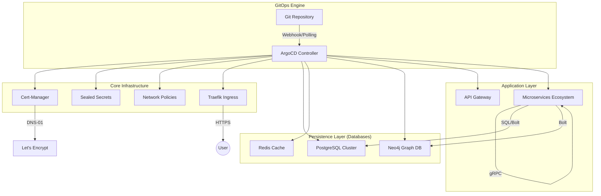
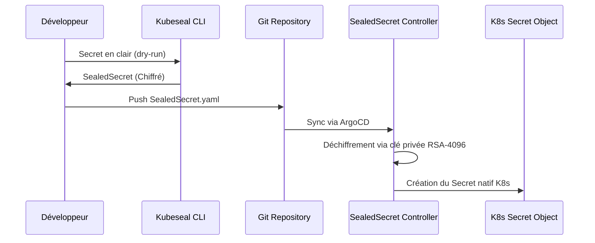
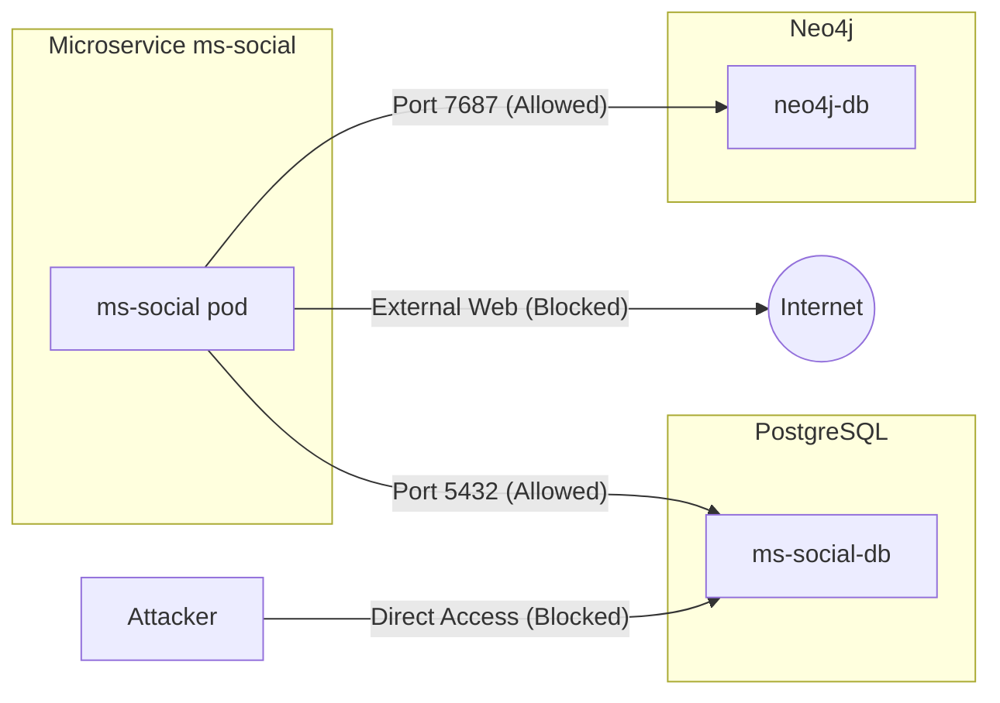

# Volontariapp GitOps Infrastructure


> [!IMPORTANT]
> Ce repository est la Source Unique de Vérité (SSOT) pour l'infrastructure Volontariapp. Toute modification de l'état du cluster doit impérativement passer par une Pull Request sur ce repo pour être synchronisée par ArgoCD.

---

## 🏗️ Architecture Globale (High-Level)

L'infrastructure repose sur le pattern **App-of-Apps**, permettant une gestion récursive et modulaire de tous les composants du cluster.



---

## 🔐 Sécurité & Conformité

Le cluster est durci selon les standards **PSA (Pod Security Admissions) Restricted**, le niveau le plus élevé de sécurité Kubernetes.

### 1. Pod Security Standards (PSS)

Tous les namespaces (`dev`, `prod`, `infrastructure`) imposent les contraintes suivantes :

- **Non-Root Execution** : Aucun container ne peut s'exécuter en tant qu'utilisateur 0 (root).
- **ReadOnly Root Filesystem** : Le système de fichiers racine est en lecture seule (volumes `/tmp` montés en `emptyDir`).
- **No Privilege Escalation** : Interdiction formelle d'élévation de privilèges.
- **Seccomp & Capabilities** : Profil `RuntimeDefault` activé et toutes les capabilities Linux supprimées par défaut (`drop: ["ALL"]`).

### 2. Sealed Secrets (Chiffrement Asymétrique)

Pour respecter le principe de GitOps sans compromettre la sécurité, nous utilisons **Bitnami Sealed Secrets**.

- **Principe** : Les secrets sont chiffrés localement avec la clé publique du cluster. Seul le contrôleur `sealed-secrets` dans le cluster possède la clé privée pour les déchiffrer.
- **Flux de travail** :



### 3. Network Policies (Zero-Trust)

Nous appliquons une politique de **Default-Deny All**. Aucune communication n'est autorisée par défaut, même au sein d'un même namespace.

- **Ingress Policy** : Chaque base de données n'accepte de connexions que des microservices explicitement listés par leur label `app`.
- **Egress Policy** : Les microservices ne peuvent sortir du cluster que pour contacter le DNS (`kube-system`) ou leurs dépendances database.



---

## 🛰️ Matrice de Communication Microservices (gRPC & HTTP)

L'architecture Volontariapp utilise une communication hybride : **HTTP/REST** pour l'entrée utilisateur via l'API Gateway, et **gRPC** pour la communication inter-services ultra-performante.

### 1. Flux gRPC Internes

Toutes les communications internes passent par le port `3000` (défini comme `http` dans les services pour simplifier, mais utilisant le protocole gRPC).

| Source        | Destination | Port   | Rôle                       |
| :------------ | :---------- | :----- | :------------------------- |
| `api-gateway` | `ms-user`   | `3000` | Authentification & Profils |
| `api-gateway` | `ms-post`   | `3000` | Flux d'actualités          |
| `api-gateway` | `ms-event`  | `3000` | Gestion des événements     |
| `api-gateway` | `ms-social` | `3000` | Relations & Interactions   |
| `ms-social`   | `ms-user`   | `3000` | Validation des identités   |
| `ms-event`    | `ms-post`   | `3000` | Publication automatique    |

### 2. Protocole de Connexion Database

| Microservice | Database Type | Port   | Instance (Prod)           |
| :----------- | :------------ | :----- | :------------------------ |
| `ms-user`    | PostgreSQL    | `5432` | `ms-user-db-postgresql`   |
| `ms-post`    | PostgreSQL    | `5432` | `ms-post-db-postgresql`   |
| `ms-event`   | PostgreSQL    | `5432` | `ms-event-db-postgresql`  |
| `ms-social`  | PostgreSQL    | `5432` | `ms-social-db-postgresql` |
| `ms-social`  | Neo4j (Bolt)  | `7687` | `neo4j`                   |

---

## 🛡️ Focus Sécurité : Le "Wait-For" Lifecycle

Pour éviter les crashs en boucle (`CrashLoopBackOff`) dus à des bases de données plus lentes que les services, nous implémentons une stratégie de **Séquençage de Démarrage**.

### Anatomie d'un InitContainer

Chaque microservice possède un initContainer basé sur `busybox` qui bloque le démarrage tant que la dépendance réseau n'est pas "Open".

```yaml
initContainers:
  - name: wait-for-db
    image: busybox:1.28
    command:
      [
        'sh',
        '-c',
        'until nc -zv ms-social-db-postgresql 5432; do echo waiting for db; sleep 2; done;',
      ]
```

**Avantages :**

- **Prévisibilité** : Les sondes Kubernetes ne démarrent qu'une fois la connectivité assurée.
- **Auto-cicatrisation** : Si une DB redémarre, le microservice échouera ses sondes et se mettra en attente proprement via le cycle de restart de K8s.

---

## 💎 Le Cas Neo4j : Sécurisation par Injection Dynamique

Neo4j 5.x impose des contraintes fortes sur le changement de mot de passe. Notre infrastructure utilise une technique de **Bash-Wrapper** dans le patch Kustomize pour assurer la sécurité sans mot de passe en clair.

### Le Patch de Sécurité (`neo4j-security-patch.yaml`)

Nous désactivons `NEO4J_AUTH_PATH` pour forcer Neo4j à lire la variable d'environnement `NEO4J_AUTH` que nous construisons dynamiquement :

```yaml
command:
  - '/bin/bash'
  - '-c'
  - 'export NEO4J_AUTH=neo4j/$NEO4J_TEMP_PASSWORD && /startup/docker-entrypoint.sh neo4j'
```

Cette méthode garantit que le mot de passe réel provient uniquement de ton **SealedSecret**, rendant le repository Git totalement inoffensif en cas de fuite de code.

---

## 📈 Gestion des Ressources & Quotas

Pour garantir la stabilité du cluster K3s, des `ResourceQuotas` et des `LimitRanges` sont appliqués sur chaque namespace.

| Composant     | Requests (CPU/RAM) | Limits (CPU/RAM) |
| :------------ | :----------------- | :--------------- |
| API Gateway   | 50m / 64Mi         | 200m / 128Mi     |
| Microservices | 100m / 128Mi       | 500m / 256Mi     |
| PostgreSQL    | 100m / 256Mi       | 500m / 512Mi     |
| Neo4j         | 200m / 512Mi       | 500m / 1Gi       |
| Redis         | 50m / 64Mi         | 100m / 128Mi     |

---

## 🏗️ Structure détaillée du Repository

```text
.
├── .github/ workflows/      # Pipelines CI (Gitleaks, Lint, Build)
├── apps/
│   ├── base/                # Définitions génériques (Images, Ports, Env)
│   │   ├── api-gateway/     # Point d'entrée HTTP
│   │   ├── ms-user/         # Service Identité
│   │   ├── ms-post/         # Service Contenus
│   │   ├── ms-social/       # Service Graphe & Relations
│   │   └── ms-event/        # Service Événements
│   └── overlays/
│       ├── dev/             # Configuration spécifique Développement
│       └── prod/            # Configuration durcie Production
├── infrastructure/
│   ├── argocd/              # Définitions des "Applications" ArgoCD
│   ├── databases/           # Charts Helm PostgreSQL, Redis, Neo4j
│   ├── security/
│   │   ├── cert-manager/    # Gestion TLS DNS-01
│   │   ├── network-policies/# Isolation réseau par namespace
│   │   └── sealed-secrets/  # Clés de déchiffrement
│   └── namespaces/          # Labellisation PSA Restricted
├── submodules/              # Code source NestJS (en lecture seule ici)
└── PROGRESS.md              # Journal de bord technique
```

---

## 🛠️ Runbook d'Urgence (Opérations de secours)

### Scénario A : Une base de données est corrompue ou bloquée

Si une DB (ex: Neo4j) refuse de démarrer après un changement de secret :

1. **Scale Down** : `kubectl scale statefulset neo4j -n prod --replicas=0`
2. **Purge Volume** : `kubectl delete pvc data-neo4j-0 -n prod` (Attention : Perte de données !)
3. **Scale Up** : `kubectl scale statefulset neo4j -n prod --replicas=1`
4. **Sync** : ArgoCD recréera le disque proprement.

### Scénario B : ArgoCD est désynchronisé (Out of Sync)

Si un composant reste "Out of Sync" malgré vos pushs :

1. Vérifiez les logs du contrôleur ArgoCD.
2. Utilisez l'option **"Replace"** au lieu de "Apply" si des ressources immuables ont changé.
3. Vérifiez qu'un patch Kustomize ne cible pas un nom d'objet inexistant.

### Scénario C : Certificats expirés ou en erreur

Si `https://cyrus-ag.com` affiche une erreur de certificat :

1. Vérifiez l'état de l'ordre : `kubectl get certificate,certificaterequest,order,challenge -n traefik`.
2. Vérifiez le secret de l'API Cloudflare : `kubectl describe secret cloudflare-api-token-secret -n cert-manager`.

---

## 📝 Glossaire Technique

- **PSA (Pod Security Admission)** : Système natif K8s remplaçant les PSP pour valider la sécurité des pods.
- **Kustomize** : Outil de personnalisation des manifests sans templates (contrairement à Helm).
- **DNS-01 Challenge** : Méthode de validation SSL via des records DNS (permet le Wildcard).
- **SealedSecret** : Objet Kubernetes chiffré pouvant être versionné sur Git.
- **StatefulSet** : Contrôleur K8s pour les applications nécessitant un état (bases de données).
- **gRPC** : Framework RPC de Google utilisant Protocol Buffers et HTTP/2.

---

## 🤖 CI/CD & Qualité

Chaque Push déclenche une pipeline GitHub Actions :

- **Gitleaks** : Scan de sécurité pour empêcher l'envoi de secrets en clair.
- **Kustomize Build** : Vérifie que tous les overlays sont valides et compilables.
- **Kube-score** : Analyse statique des manifests pour vérifier la conformité aux bonnes pratiques Kubernetes (securityContext, ressources, etc.).

---

© 2026 Volontariapp
