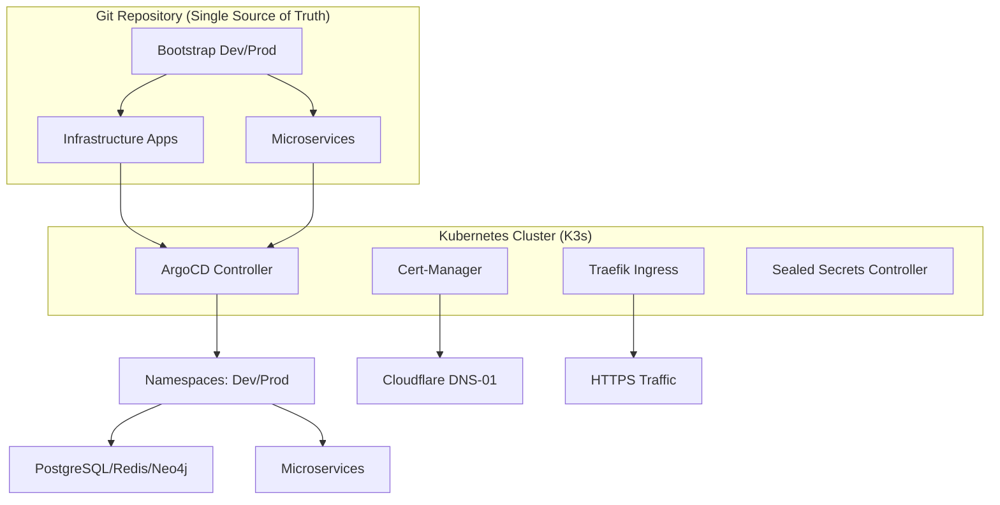

# Volontariapp GitOps Infrastructure

> [!NOTE]
> This repository serves as the central GitOps orchestrator for the Volontariapp ecosystem, managing multi-environment deployments on K3s through ArgoCD and Kustomize.

## 🏗 Architecture Overview

The infrastructure follows a declarative "App-of-Apps" pattern, ensuring that the cluster state remains synchronized with the Git repository.



## Security Framework

The infrastructure implements a Zero-Trust security model with a focus on compliance and isolation.

| Component             | Implementation                                         | Security Level |
| :-------------------- | :----------------------------------------------------- | :------------- |
| **Secret Management** | Bitnami Sealed Secrets (RSA-4096)                      | [ENCRYPTED]    |
| **Network Isolation** | Namespace-level NetworkPolicies (Default-Deny)         | [ISOLATED]     |
| **Workload Security** | Pod Security Admission (PSA) - Restricted Mode         | [RESTRICTED]   |
| **Ingress Security**  | Traefik Middlewares (HSTS, Secure Headers, Rate-Limit) | [PROTECTED]    |
| **Identity / TLS**    | Cert-Manager with DNS-01 Cloudflare Challenge          | [VERIFIED]     |

## Repository Structure

```text
.
├── apps/                    # Application manifests (Base & Overlays)
├── infrastructure/
│   ├── argocd/              # AppProject & Bootstrap Application manifests
│   ├── databases/           # Stateful sets and persistence (PostgreSQL, Redis, Neo4j)
│   ├── security/            # Cert-Manager, NetworkPolicies, SealedSecrets
│   └── namespaces/          # Namespace definitions and PSA labels
├── submodules/              # Links to microservice source code
└── PROGRESS.md              # Detailed implementation logs and roadmap
```

## Deployment Workflow

### Prerequisites

- K3s cluster with ArgoCD installed.
- `kubeseal` CLI for secret management.
- Access to GitHub Container Registry (GHCR).

### Bootstrapping an Environment

To initialize the development environment, apply the root bootstrap manifest:

```bash
kubectl apply -f infrastructure/argocd/bootstrap/dev.yaml
```

### Secret Management

Secrets must never be stored in plain text. Use the following pattern to seal a secret:

```bash
kubectl create secret generic example-secret --from-literal=key=value --dry-run=client -o yaml | \
kubeseal --controller-namespace kube-system --controller-name sealed-secrets --format=yaml > secret-sealed.yaml
```

---

© 2026 Volontariapp Core Team
